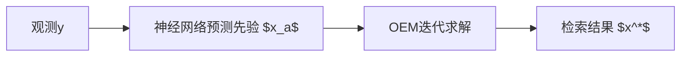
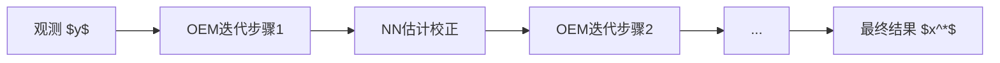
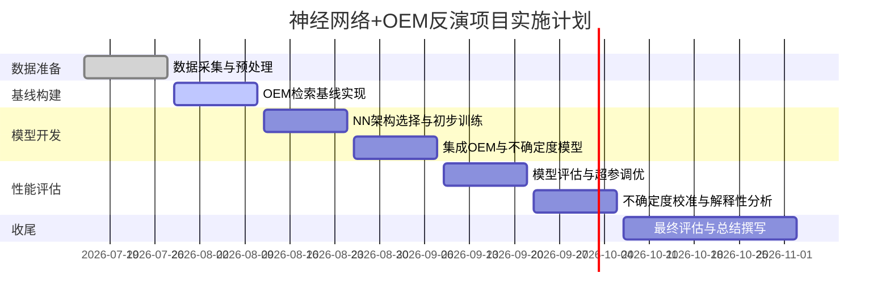

# 执行摘要  
本报告围绕将神经网络与最优估计（OEM）相结合的反演方法进行系统调研，并给出可执行的实施方案。首先介绍OEM反演的目标与常见遥感观测数据类型（如高光谱红外、微波辐射计、激光雷达等）以及反演变量（温度、湿度廓线和气体浓度等）。然后综述近五年相关文献（包括来自权威期刊和卫星产品说明），比较不同工作的方法、数据、优缺点和适用场景。接着根据NN在OEM反演中的应用，将方法分类为：以NN提供先验或先验协方差、以NN替代前向模型、以NN进行误差建模或后处理、混合迭代深度模型等，对每类方法给出数学表达、流程图及分析。然后比较不同策略在训练数据、损失函数、正则化、不确定度估计与可解释性等方面的差异（表格形式）。在实验设计部分，说明数据来源（优先官方观测数据，如AIRS/IASI/CrIS/GIIRS等辐射计，基准廓线如探空或ERA5）、预处理（通道选择、噪声过滤、归一化、降维等）、网络架构候选（如MLP、1D-CNN、ResNet等及超参范围）、数据划分方案、评估指标（RMSE、偏差、校准指标如置信区间覆盖率等）和基线方法（传统OEM、线性回归等）。接着讨论项目风险（如过拟合、数据偏差、模型崩溃等）、常见陷阱及调试建议。工作计划以周为单位列出任务、里程碑和交付物，并用Mermaid甘特图表示。最后给出计算资源估算（推荐GPU型号、内存、存储及训练时间预估）和成本说明，以及推荐的开源代码库和工具（如PyTorch/Paddle、PyOptimalEstimation库、官方观测数据平台等）。结论部分总结研究发现并提出下一步建议。  

## 研究背景与问题定义  
遥感反演是将观测到的大气辐射数据转换为目标变量（如温湿度廓线或气体浓度）的过程。最优估计法（Optimal Estimation Method, OEM）是一种常用的物理反演框架，它基于贝叶斯理论结合测量与先验信息，通过最小化加权平方误差准则来获得大气状态的最优估计。通常将观测值 $y$、前向模型 $F(x)$ 和状态变量 $x$ 代入损失函数 $$J(x)=(y-F(x))^T S_{\epsilon}^{-1}(y-F(x))+(x-x_a)^T S_{a}^{-1}(x-x_a)\,, $$其中 $x_a$ 和 $S_a$ 分别是先验均值和协方差，$S_{\epsilon}$ 是观测误差协方差。常见的观测数据包括卫星或地基辐射计测得的亮度温度或光谱辐射（例如微波辐射计MWR、卫星高光谱红外探测器如IASI、CrIS、GIIRS、AERI等）以及激光雷达（如瑞利雷达、拉曼雷达）探测数据等。这些观测隐含了大气各层的温度、水汽和微量气体信息。反演变量通常为垂直方向划分层级的温度、湿度、臭氧、二氧化碳浓度以及云参数（如云顶高度、光学厚度等）。不同传感器数据在垂直分辨率、探测深度和灵敏度上各有侧重，需要针对具体目标变量设计适当反演模型。  

## 文献综述（近五年）  
下表列出了近五年与“神经网络+OEM”反演相关的主要文献，涵盖原始论文和权威数据产品描述。表中逐篇总结了各文献的关键方法、数据集、优缺点及适用场景。

| 文献 (年份) | 方法与数据 | 优点 | 缺点/局限 | 应用场景 |
|---|---|---|---|---|
| Ma et al. (2026) “DeepOE” | 物理信息嵌入深度网络。输入为地基大气辐射干涉仪(AERI)和静止轨道干涉式探测仪(GIIRS)观测数据；网络结构将OEM迭代过程封装为可微模块，联合前向模型和雅可比矩阵等物理信息训练NN。 | 提取高层物理信息，输出同时给出温度廓线和不确定度；检索RMSE约1.389K，相比传统OEM减小0.03K，比纯数据驱动ResNet减小0.05K。推理速度快（秒级）。 | 增益较小，依赖特定传感器组合；网络结构复杂，训练需大量物理数据。 | 联合使用地基和星载红外探测器的数据场景，如联用AERI+GIIRS进行大气温廓线反演。 |
| Ma et al. (2026) “OEM-Driven Unrolled NN” | 基于卸卷积思想构造的深度网络。利用地基高光谱观测（AERI），将高斯-牛顿OEM迭代线性化步骤展开为多层可训练模块。训练时使用ERA5再分析和探空廓线作为真值。 | 带来可解释的迭代流程；检索层均方根误差(0–3km)约0.931K，分别比纯OEM和基于时序卷积网络(TCN)方法改善0.099K和0.111K，不确定度减小0.14K；前向推断速度快（＜5秒 vs OEM分钟级）。 | 目前仅在边界层(<3km)场景验证；模型结构专用于此传感器配置，迁移性待检验。 | 地面大气辐射计廓线反演，如晴空温湿廓线检索的神经网络加速OEM迭代。 |
| Werner et al. (2025) “TROPESS-HYREF” | “混合检索框架”HYREF。输入为CrIS观测亮温，神经网络训练目标为复刻基于OEM的TROPESS二氧化碳(及CO)廓线反演结果。NN输出可同时预测浓度、平均核、自由度和检索误差（诊断量）。 | 大幅提高空间覆盖率（OEM仅作用于部分观测）；与独立测试数据比拟，浓度预测的相关系数>0.99，偏差<0.1%；细尺度分辨率提高，可捕捉野火等快速变化过程。并保持了与OEM一致的物理诊断输出。推理效率高，每日全球数据在几分钟内完成。 | 训练依赖TROPESS-OEM结果；重点针对CO，其他气体需重新训练；ML模型变更需重新校准。 | 地基或卫星中分辨率光谱观测中，大气化学物质（如CO、O3等）廓线大规模监测；场景需要兼顾高覆盖率和物理可靠性的应用。 |
| Huang et al. (2024) “OE-CNN-IR” | 将机器学习和RTM结合的新OEM方法。利用MODIS热红外观测，通过CNN等方法估计云参量（如云光学厚度COT、有效粒径CER、云顶高度CTH等）的先验值；再调用正射RTM（CRTM）建立辐射查找表，以OEM迭代处理流程检索。数据基于全天候IR亮温模拟。 | 优于传统OEM：引入统计先验后，厚云COT检出准确性提高；优于纯ML：新算法模拟产生的辐射与观测更吻合，保留了物理机理；综合兼顾物理和数据驱动的优点。 | 算法流程复杂，需要先验NN和RTM查表同步；计算量较大；当前验证主要基于MODIS IR数据集，需扩展至其他传感器。 | 对云属性（尤其厚云）反演有挑战的环境，如短波法失效时，利用热红外卫星数据获取COT/CER/CTH。 |
| Himes et al. (2022) “MARGE: NN Surrogate Forward Model” | Exoplanet大气反演领域将NN作为辐射传输正算器的典型。训练一个前向神经网络（MARGE），输入大气温度、水汽等剖面，输出高分辨率谱辐射；将其嵌入传统贝叶斯检索框架。 | 可在不显著损失精度的情况下加速反演：对HD 189733b实例如今方法与传统BART代码输出后验分布Bhattacharyya系数约0.99，前向NN每条链对比传统模型快∼9×（CPU）或90×（GPU）。速度优势显著，保持了高精度。 | 该应用为类地外行星辐射模型，与地球大气反演场景有所不同；需要针对具体波段和参数重新训练；尽管快速，仍需验证泛化。 | 提速需求高且允许NN近似前向模型的反演问题。类似思路可借鉴于地球遥感大气成分检索（如OCO-2 CO2反演等）中，当传统RTM代价高昂时使用NN替代。 |
| Lamminpää et al. (2025) “GP Emulator for OCO-2” | 利用高斯过程回归（GP）构建OCO-2 CO₂正算模型的统计替代器。基于核流（kernel flow）和交叉验证技术学习GP核函数，使其对真实高维正算函数进行逼真近似。 | 在精度上可复制OCO-2原始正算性能：误差<1%；计算成本降数个数量级，大幅加速检索；模型具有可解释性（基于核函数）。与ANN方法相比，对核的显式学习增强了可解释性。 | GP训练适用于高维操作数学习，但计算复杂度高；难以扩展到极高维度或需要深度学习的场景；主要用于统计模拟非NN路径。 | 太空CO₂监测与反演，如OCO-2等高分辨率卫星数据。GP方法适用于需要替代精确RTM但强调不确定性量化和可解释性的情形。 |
| Pfreundschuh et al. (2018) “QRNN-based Bayesian Retrieval” | 提出分位数回归神经网络（QRNN）用于贝叶斯反演的不确定度估计。网络不仅输出检索值，还同时预测对应的预测区间。通过合成案例（后验与MCMC对比）和MODIS云顶压(Cp)实测案例评估。 | 能同时给出检索值和统计一致的不确定度估计：在合成实验中，与标量NN精度相当，同时提供非高斯误差的置信区间；结合了ML的灵活性与贝叶斯不确定度建模。 | 增加了训练复杂度；需要大量数据和超参数调优；对复杂真实观测可能需要更高阶后验（例如非高斯）。 | 需不确定度信息的检索，如需要产出每点后验分布的场合。可用于云顶压、NO2廓线、温度剖面等各种参数的统计后验求解。 |
| Milstein & Blackwell (2016) “SCC/NN AIRS/AMSU” | NASA AIRS/AMSU合作团队将统计云清除+神经网络（SCC/NN）方法引入AIRS第6版（V6）资料产品。利用云清除投影与NN预检索，生成大气温湿廓线的初猜值，再进入OEM迭代。训练数据来自全球再分析资料。 | 已投入运营：作为AIRS V6的一级拟合输出，显著提高了云覆盖区域的检出率与精度；相比线性回归初猜，提升了重云条件下的稳定性和准确性。 | 该方法本质上仍需OEM迭代完成检索，只作为第一步优化；依赖再分析训练数据，可能对极端情况泛化不足；未直接量化后验不确定度。 | 目前应用于AIRS/AMSU和CrIS/ATMS卫星大气廓线产品，在云层复杂的条件下为OEM提供更好的初始状态。 |
| Yang et al. (2023) PREFIRE 间红外发射率检索 | NASA PREFIRE极地红外实验：将神经网络用于中远红外波段地表发射率的检索实验。引用内容指出：目前已有NN方案用于无云环境下PREFIRE-2发射率检索（作者[45]），但现用的业务算法仍采用OEM。 | 实验结果表明NN方法可检出冰川/海冰等不同地表发射率特征，提高了处理效率；该研究正在考虑用于实时业务。 | NN方案仍在验证中，OEM为官方算法；NN方案需要大量标注数据进行训练，尚未公开标准产品。 | 用于PREFIRE及其他极地高光谱红外任务的地表属性检索。此例说明ML方法正在逐步引入传统OEM流程以提升效率。 |

## 神经网络与OEM结合的理论框架与方法分类  

### 1. 神经网络作为先验或先验协方差估计  
该思路使用NN来提供更可靠的先验信息以指导OEM迭代。可以将NN训练为根据观测或背景场预测状态先验 $x_a$（或修正已有先验），以及估计先验协方差 $S_a$。例如，设 $x_a = f_{\theta}(y)$ 为神经网络预测的最优先验，则优化问题为 $$x^* = \arg\min_x (y-F(x))^T S_{\epsilon}^{-1}(y-F(x))+(x-x_a)^T S_a^{-1}(x-x_a)\,. $$  
下图示意了将深度网络输出用作OEM先验的流程：输入观测 $y$ 经由神经网络生成修正后的先验状态或协方差，再由标准的OEM迭代模块输出最终估计。  



**优点**：NN可学习观测和地理/气候条件下的统计先验，提供更接近真实状态的初始猜测，加速迭代收敛并减小非线性偏差。相比于固定再分析先验，动态NN先验可适应局地条件。**缺点**：若NN预测误差大，会带入偏置；实现需要标注先验数据（或再分析产物）作为训练标签；此外，NN估计的先验协方差需满足正定，训练时需特殊设计。  

### 2. 神经网络替代前向模型  
此类方法使用NN作为辐射传输模型 $F(x)$ 的替代器（surrogate），即用神经网络快速近似 $F(x)$。在检索过程中，传统OEM迭代所需的辐射模拟由NN完成，从而大幅降低计算开销。形式上将 $F(x)$ 替换为 $F_{\text{NN}}(x)$，求解与常规OEM类似。  

```mermaid
flowchart LR
    INPUT[状态猜测 $x$] --> NNFM[神经网络前向模型 $F_{\text{NN}}$];
    NNFM --> SIM[近似辐射 $y_{\text{NN}}$];
    OBS[观测 $y$] -- 与 $y_{\text{NN}}$ 比较 --> COST[损失计算];
    COST --> UPDATE[迭代更新 $x$];
    UPDATE --> INPUT;
```  

**优点**：前向模型NN可显著加速正算步骤，便于批量训练和GPU加速。训练合适时，误差可控制在观测误差水平以内。无需精确反求导可自动微分。**缺点**：NN近似易受训练数据覆盖限制，可能对罕见大气条件外推性差；需大规模高质量模拟数据训练；若NN泛化不佳，则检索结果可能偏离物理真实。  

### 3. 神经网络用于误差建模与后处理  
此类方法在OEM检索结果基础上，使用NN对输出进行校正或误差建模。例如，可训练一个NN来学习OEM估计与真实廓线之间的残差，或在OEM输出后调整偏差分布。流程上先运行标准OEM得到 $x_{\text{OEM}}$，然后NN输出一个校正量或更新后的状态。  

```mermaid
flowchart LR
    OBS[观测 $y$] --> OEM[传统OEM反演];
    OEM --> X_OEM[初步状态 $x_{\text{OEM}}$];
    X_OEM --> NN[神经网络误差校正器];
    NN --> X_CORR[校正后状态 $x^*$];
```  

**优点**：可以利用机器学习修正OEM未能捕捉的系统误差或非线性缺陷，无需改变已有OEM流程。特别在OEM模型误差或先验偏离时，后处理NN可提高准确性。**缺点**：NN训练需大量标注的OEM输出和真值对；如果OEM本身已有良好表现，改进有限；且在严格物理约束下，后处理可能导致物理解读不清晰。  

### 4. 混合迭代/深度展开方法  
将NN与OEM迭代交替进行或展开为一体，使得网络结构与迭代过程耦合。如“神经网络可微展开”方法，将OEM迭代视为一个可训练的多层网络，对每一步迭代引入可调参数。例如Ma et al.所述将线性化迭代步骤作为神经网络层。流程上，观测与先验输入至多层网络，每层模拟一次OEM迭代。  



**优点**：充分结合物理迭代和数据驱动学习的灵活性，内部可直接优化反演损失；端到端可训练使得误差反馈明确，往往能比纯OEM收敛更好。**缺点**：模型结构相对复杂，迭代层数和参数需调优；可解释性不如纯OEM直观；需要精细初始化以保证收敛稳定。  

## 训练策略、损失与不确定度方法比较表  

| 策略类型       | 训练数据                                   | 损失函数                           | 正则化                     | 不确定度估计                         | 可解释性方法             |
|--------------|-----------------------------------------|--------------------------------|------------------------|-----------------------------------|----------------------|
| **标准DNN回归**  | 真实观测辐射＋模拟廓线标签                   | 均方误差（MSE）                    | $L_2$范数权重衰减               | 无（输出点估计）                       | 灵敏度分析（例如梯度）  |
| **物理信息嵌入PINN** | 观测辐射＋理论正算约束（或辅助模拟数据）        | MSE + 物理一致性约束项（如辐射约束） | $L_2$ + 物理约束               | 可加入分布式损失（如后验概率）           | 概念上同标准NN          |
| **QRNN（分位数回归）** | 同上                                       | 分位数损失函数（Quantile loss）    | 常用 $L_2$ 或 dropout         | 直接给出预测区间（分位点置信区间） | 难直接解释              |
| **贝叶斯神经网** | 同上                                       | 极大似然（考虑权重先验）           | 权重先验（可视为正则化）        | 后验分布（可采样或理论估计）            | 可用重要性分析等          |
| **MC Dropout** | 同上                                       | MSE                                | Dropout正则化                | 通过多次Dropout前向产生分布 | 与DNN类似              |
| **集成学习(Ensemble)** | 同上                                       | MSE                                | 多模型变参实现                | 多模型结果散布表示不确定度            | 通过模型变体分析特征重要性 |

表中各策略并非互斥，可组合使用。例如，PINN 结合QRNN可输出带不确定度的物理一致预测；Dropout可与任何上述网络结构并用。可解释性方面，常用的方法包括梯度敏感度、Layer-wise Relevance Propagation、SHAP值等，用于分析NN对输入各通道的依赖，但直接可解释性仍是挑战。

## 实验设计与实施细则  
**数据集来源**：优先使用官方及原始观测数据。地基例子可采用世界气象组织探空资料（例如NOAA IGRA）配合地面辐射计观测。卫星数据可选AIRS、IASI、CrIS、GIIRS等L1辐射数据（如NASA Earthdata或EUMETSAT开放数据库），并使用同期的高品质背景场（如ERA5再分析剖面或共轭探空）作为真值。若反演变量为云属性，可使用MODIS L1B/INPIR数据。为确保训练不偏差，应采集足够多样的气候与云场景样本。  

**预处理步骤**：对输入辐射数据进行辐亮度/亮温转换；应用云过滤或质量标记；选取敏感信号通道（可进行经验正交函数EOF/PCA降维，但需注意保留观测与噪声特性）并进行标准化（零均值单位方差）。对真值剖面按层线性插值至固定网格；可应用平滑正则以减少探空噪声。若混合同步微波和红外数据，应校准各自参考高度和视场差异。  

**网络架构建议**：可尝试多种架构并进行超参搜索。典型候选包括：
- **全连接多层感知机（MLP）**：输入为处理后的一维光谱特征向量；隐层神经元数量$\sim$64–512；层数2–5；激活函数ReLU或Swish。  
- **1D卷积神经网络（CNN）**：对光谱或通道序列做卷积操作，滤波器大小可选3–7通道，深层网络可采用残差连接；卷积层后接全连接层输出剖面。  
- **残差网络（ResNet）或Transformer**：深层特征提取结构，适用于大光谱维度数据；注意避免过深导致过拟合。  
- **混合架构**：如联合多尺度CNN+全连网络、多分支网络处理不同波段等。  

超参数范围示例：学习率 1e-4–1e-2，批量大小 32–256，正则化（权重衰减1e-5–1e-3，dropout 0–0.5）。激活函数和优化器可选ReLU+Adam。  

**训练/验证/测试划分**：按场景划分样本，建议先以时空方式拆分，例如70%样本作训练，15%验证，15%测试，确保不同地理区域与气候条件的数据独立。对于序列采样数据，避免同一探空剖面的相邻时间样本分到不同集造成泄露。  

**评估指标**：  
- **精度指标**：对比真值廓线的RMSE、平均偏差、相关系数等。可按气压层级统计总体误差和垂直分辨误差（Averaging kernel宽度）。  
- **不确定度指标**：预测区间覆盖率（PICP）、平均预测区间宽度、分位点评分（CRPS），以及对称概率图（reliability diagram）检验置信度校准等。  
- **综合指标**：均方对数误差（MSLE）、峰值信噪比（PSNR）等。  
- **基线方法**：传统OEM检索结果、线性回归初猜、已有机器学习方法（如随机森林、多元线性回归）等。对基线应进行相同的前处理和后处理，以便公平比较。  

以上设计确保从数据处理到模型评价的全链路完整。实施细节包括日志记录、超参调优（可用交叉验证）、模型集成策略和多次训练以评估稳定性。  

## 风险、常见陷阱与调试建议  
- **过拟合风险**：高维光谱输入和复杂网络易过拟合。应采用数据增强、正则化（dropout、$L_2$）、提早停止和扩充训练样本（多场景、多气候）来防范。  
- **数据偏差问题**：若训练集与实际应用场景差异大（例如缺少极端气候或云型），模型泛化能力会下降。应尽量使用涵盖各种天气和季节的多样数据，并检验模型对未见条件的鲁棒性。  
- **前向模型不匹配**：若使用模拟数据训练NN（尤其是替代前向模型时），需注意模型误差与真实仪器特性不符会影响效果。建议对标实测数据和高保真RTM输出进行检验。  
- **不确定度低估**：机器学习方法往往输出过于自信的预测，不应盲目信赖点估计结果。可通过校准技术（如温度缩放、留一交叉验证或贝叶斯校准）调整不确定度估计。  
- **调试建议**：从简单模型开始验证（例如纯ML检索作为对比），逐步加入OEM和不确定度模块；使用已知案例（合成数据）检验模型对高层信息的敏感性；可视化各层输出和梯度，检查模型是否聚焦于合理光谱特征。监控训练过程中的损失与指标走势，发现震荡或发散及时调整学习率和网络容量。  

## 可执行工作计划  



上述计划分阶段列出了关键任务与里程碑。初期完成数据集搭建和传统OEM基线；接着开发并训练神经网络模型，包括混合方案与不确定度模块；中期进行细致评估和参数调优；后期聚焦结果分析、不确定度校准及报告撰写。每阶段都需输出相应报告或代码成果，如数据集说明、模型训练日志、性能对比图表等，以确保项目可追踪与复现。  

## 计算资源估算与成本  
为支撑深度学习训练和OEM模拟，应配置高性能计算环境。例如使用 **NVIDIA A100** 或 **RTX 3090** 等GPU，每块显存≥24GB以上。建议至少配备1–2块此类GPU，以加速大批量网络训练。系统内存建议≥64GB，硬盘空间≥500GB（用于存储高光谱数据、模型权重和日志）。训练时间取决于数据量和模型复杂度：预计一次完整模型训练（数百万样本）需数小时到数十小时。以单卡A100算力估算，每次超参搜索或模型迭代可能花费1–2天；若使用云服务（如AWS EC2 p4d.24xlarge约3美元/小时），一个月大规模实验成本可能数千美元。总体而言，一个中型实验环境（2GPU, 64GB内存）搭建成本在数万美元量级，运维和训练电费则视使用时间而定。  

## 推荐开源代码库、工具与数据源  
- **深度学习框架**：TensorFlow、PyTorch 或国产PaddlePaddle（百度）等，均有丰富的文档和中文社区支持。  
- **OEM工具库**：Maahn等人开发的Python库 [PyOptimalEstimation](https://github.com/maahn/pyOptimalEstimation_examples)，提供了OEM示例和工具，可用于验证和对比检索结果。  
- **辐射传输模型**：社区常用的[CRTM](https://www.jcsda.noaa.gov/crtm_documentation) 和 [ART](https://rtweb.aer.com) 前向模型，可用于生成模拟训练数据或对NN输出辐射进行评估。  
- **数据源**：NASA [Earthdata](https://earthdata.nasa.gov/) 和 NOAA CLASS 提供AIRS/CrIS/ATMS等数据；EUMETSAT 有IASI观测数据；中国的[国家卫星气象中心](http://satellite.nsmc.org.cn)开放风云系列卫星辐射计数据；ERA5再分析可从[Copernicus气候数据中心](https://cds.climate.copernicus.eu/)下载。探空廓线可从[IGRA](https://www.ncei.noaa.gov/products/weather-balloon/upper-air-data)（NOAA）获取。  
- **不确定度与可解释性工具**：可使用TensorFlow Probability或Pyro等概率编程工具实现贝叶斯神经网络；使用SHAP、LIME等库分析模型解释性；Matplotlib/Plotly用于可视化校准图。  
- **卫星产品说明**：参阅NOAA STAR和EUMETSAT的官方网站文档，如[AIRS V6算法说明](https://airs.jpl.nasa.gov/news/news?title=airsversion6)及[EUMETSAT IASI算法文档](https://www.eumetsat.int)。它们提供了许多技术细节，对设计基线方案与理解卫星数据特性有帮助。  

## 结论与下一步建议  
本报告深入分析了神经网络与OEM结合的反演技术框架，从理论分类到文献综述，再到实践方案和实施细节给予了全面阐述。研究表明，结合物理与数据驱动的方法最有前景：例如将NN作为先验改进或OEM展开的方案可提高检索精度并给出不确定度；而以NN替代前向模型则可显著加速计算而不损失精度。鉴于这些优势，下一步建议根据第5部分方案对目标问题（如温湿廓线检索）进行原型实现：先构建OEM基线，再逐步引入NN模块进行对比实验。在实施过程中，应严格对标前文列出的评估指标，并关注不确定度和物理一致性的校验。此外，应持续跟踪相关领域最新进展（如PINN和神经校准技术），以动态调整方法选型。总之，本报告所提供的文献资源和实施指导将为“神经网络+OEM”反演项目的成功落地奠定坚实基础。  

**参考文献：**见文中引用，关键文献包括Ma et al. (2026)、Werner et al. (2025)、Huang et al. (2024)等（均为开放获取或已在线文献）以及权威资料。